# updating_neurons

## Generative AI --   

### Understanding what ANN can process 
<ol>
  <li> Can process labeled and unlabeled data  </li>
  <li> This learning of labeled and unlabeled data is know as semi-supervised learning </li>
  <li> In semi-supervised learning ANN is trained in small amount of labeled and large amount of unlabeled data  </li>
  <li> Inshort unlabeled data help AI to generalize things </li>
</ol>

## Finally Generative AI 
<li> Is a subsuet of Deep learning which means it usage ANN that can process Labeled and unlabeled data </li>
<li> To process data GenAI is using supervised , unsupervised and semi-supervised Methods </li>

### LLM's are also subset of Deep learning 

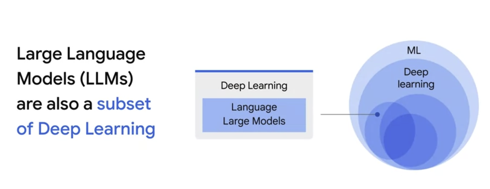

### A subset of Deep learning models 
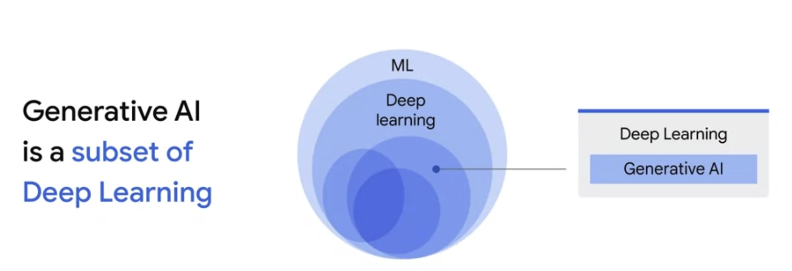

# Finally -- Deep learning models can be divided into Two catagory 

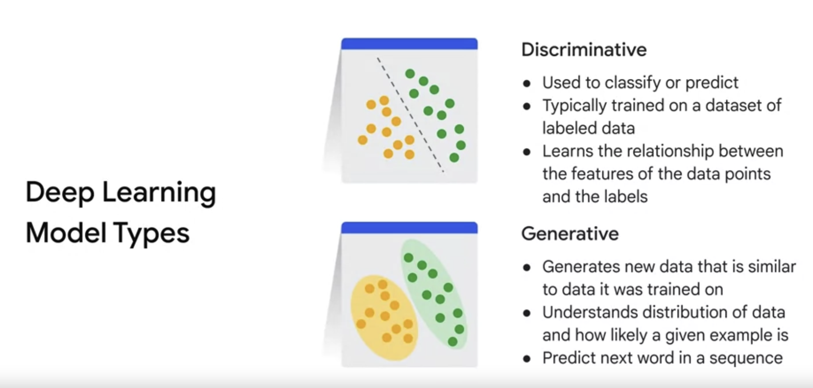

### Difference in Discriminative and Generative

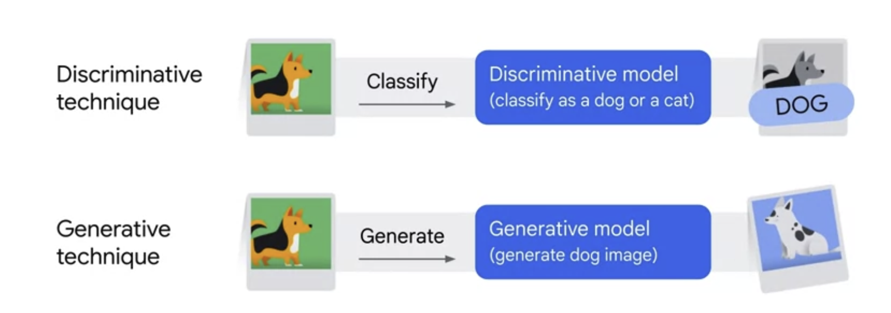

### More technical difference 

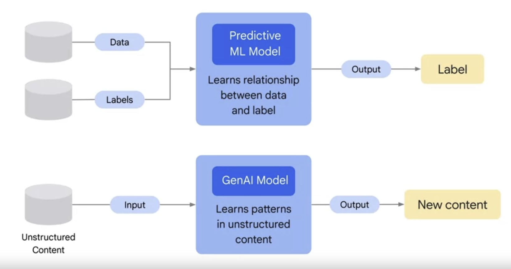

### Steps more Difference 

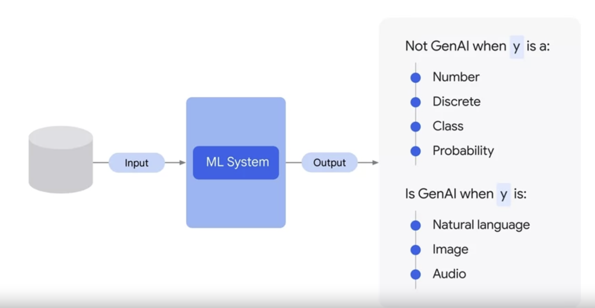

## Now we can say GenAI 

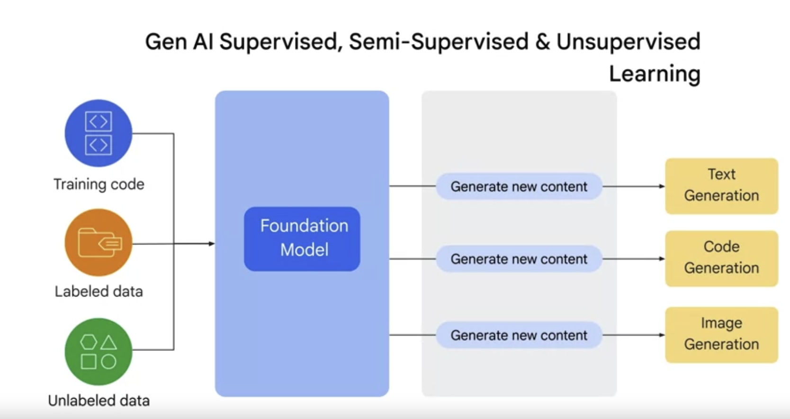

# GEN-AI -- Defined 

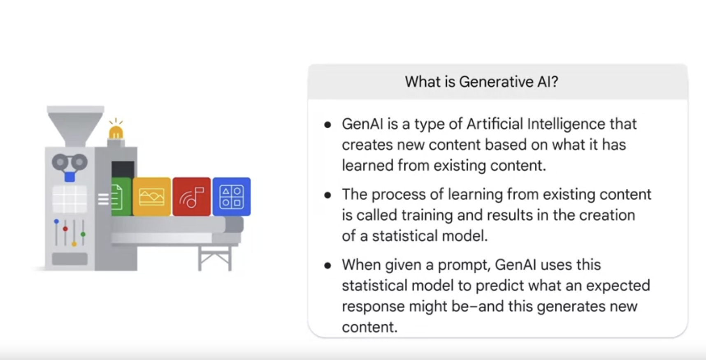

### Some Generative Models 

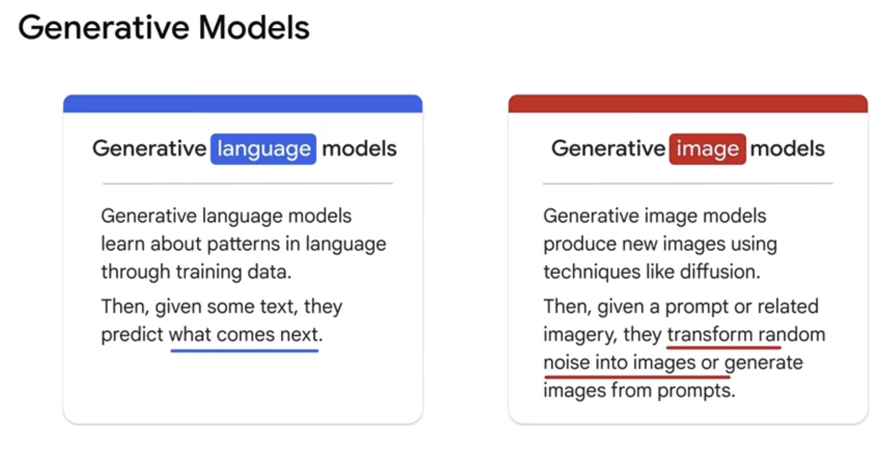

### Example of GenAI on input image data

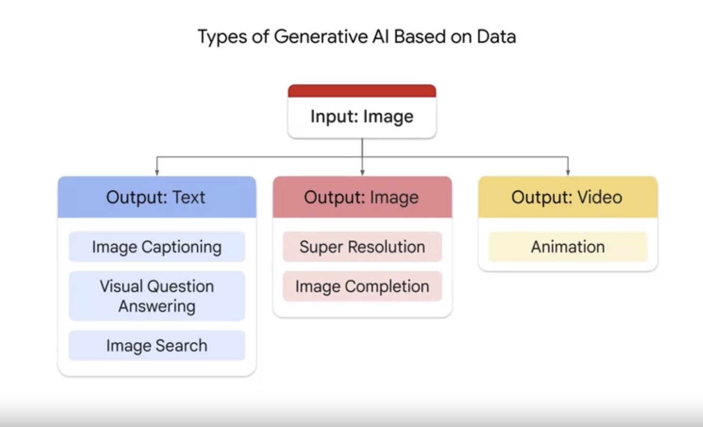

### Example of GenAI on input text data

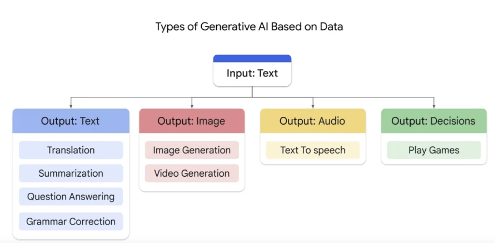

## Power of Generative AI comes from use of Transfarmers -- which is being used in NLP

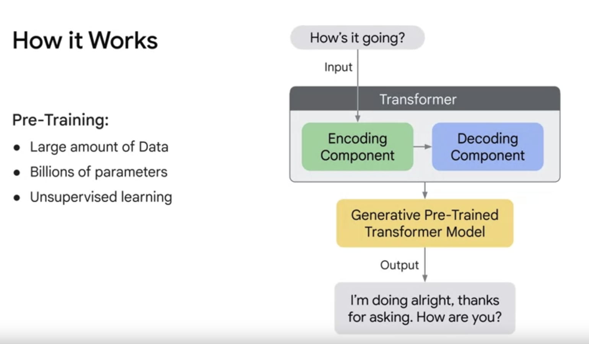

## Associated Model type in GENAI

### Text-to-Text

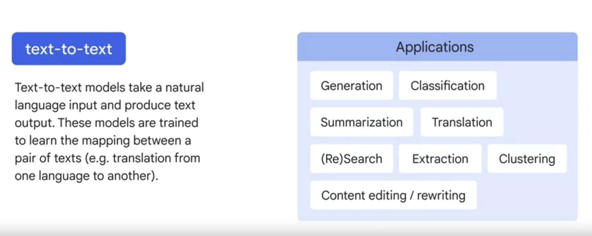

### Text-to-Image

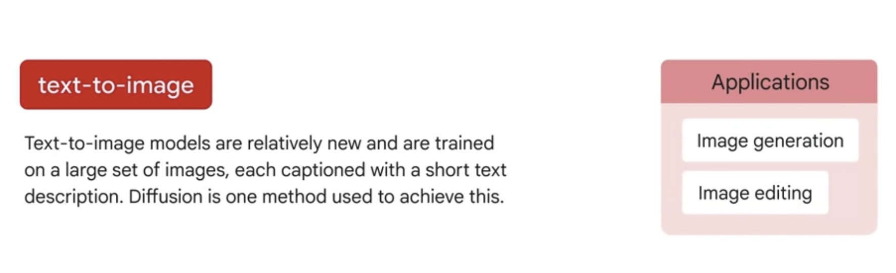

### Text-to-Video-3Dmodel

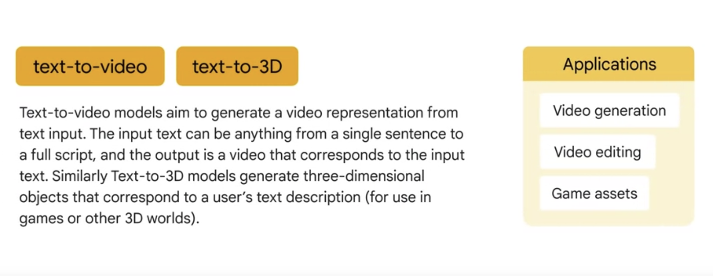

### Text-to-Task

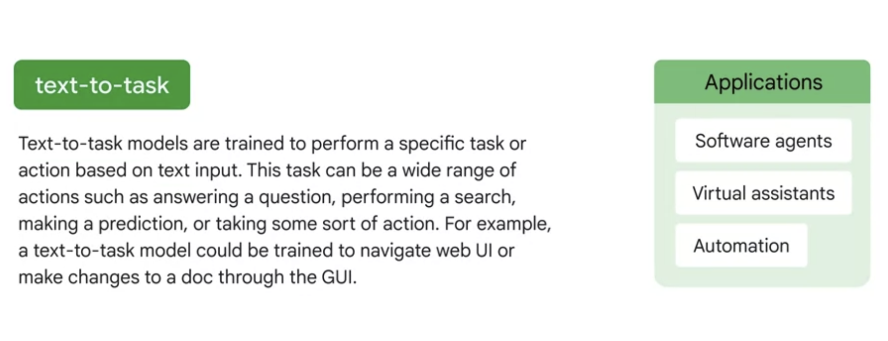
