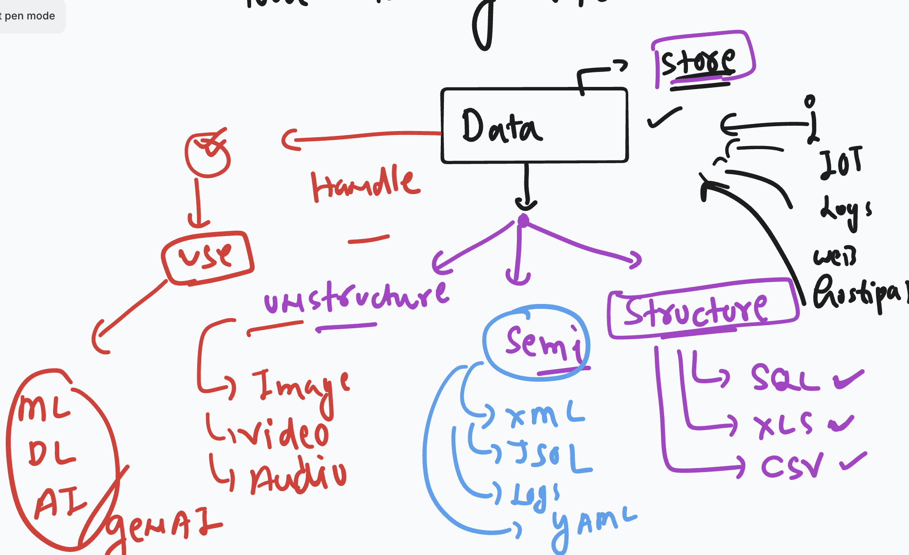
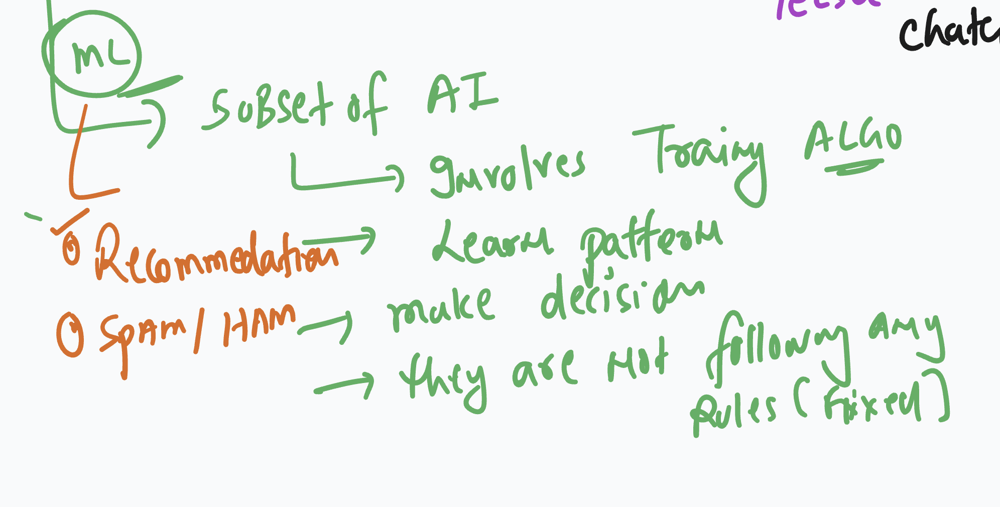
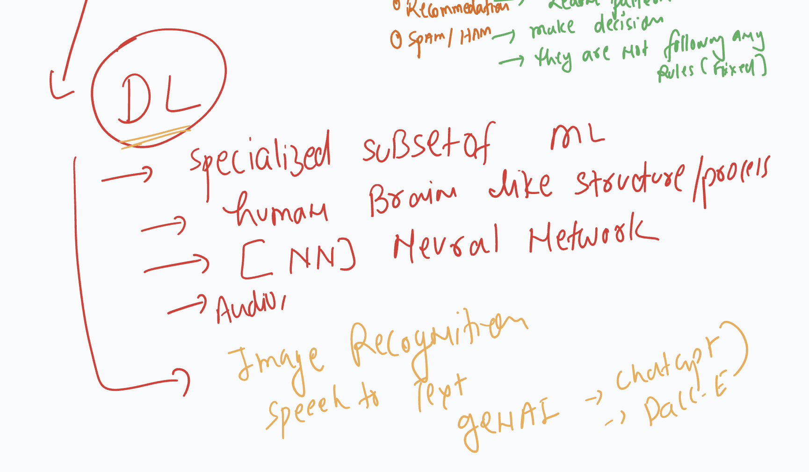
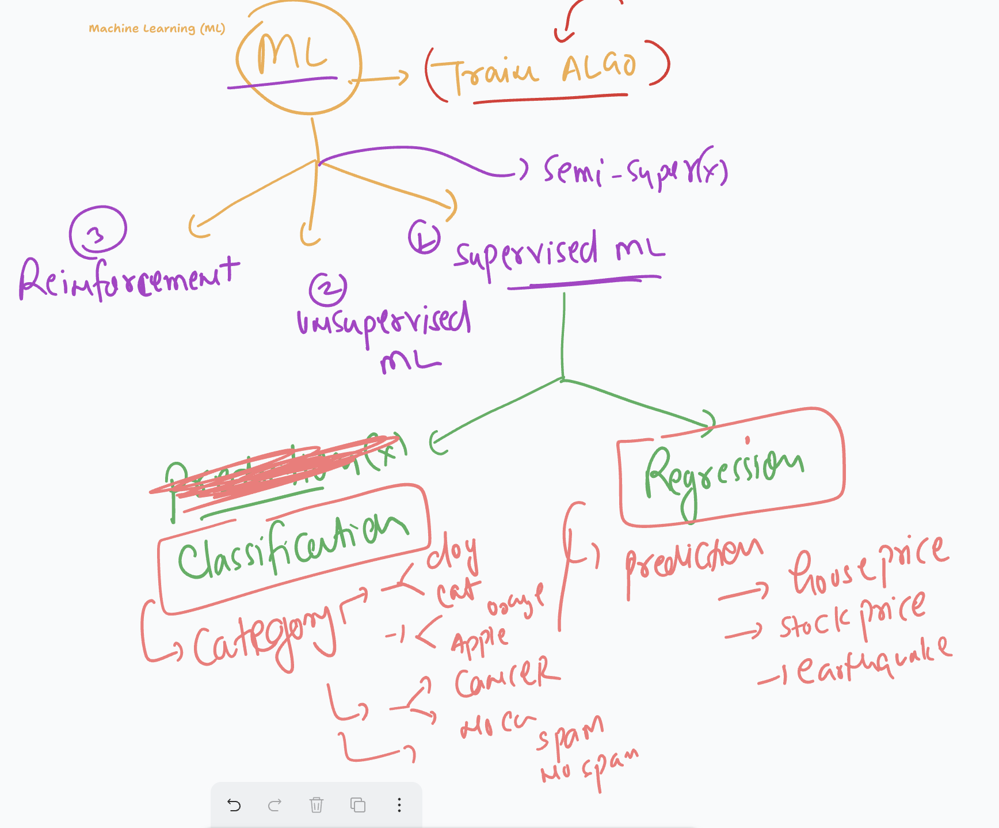
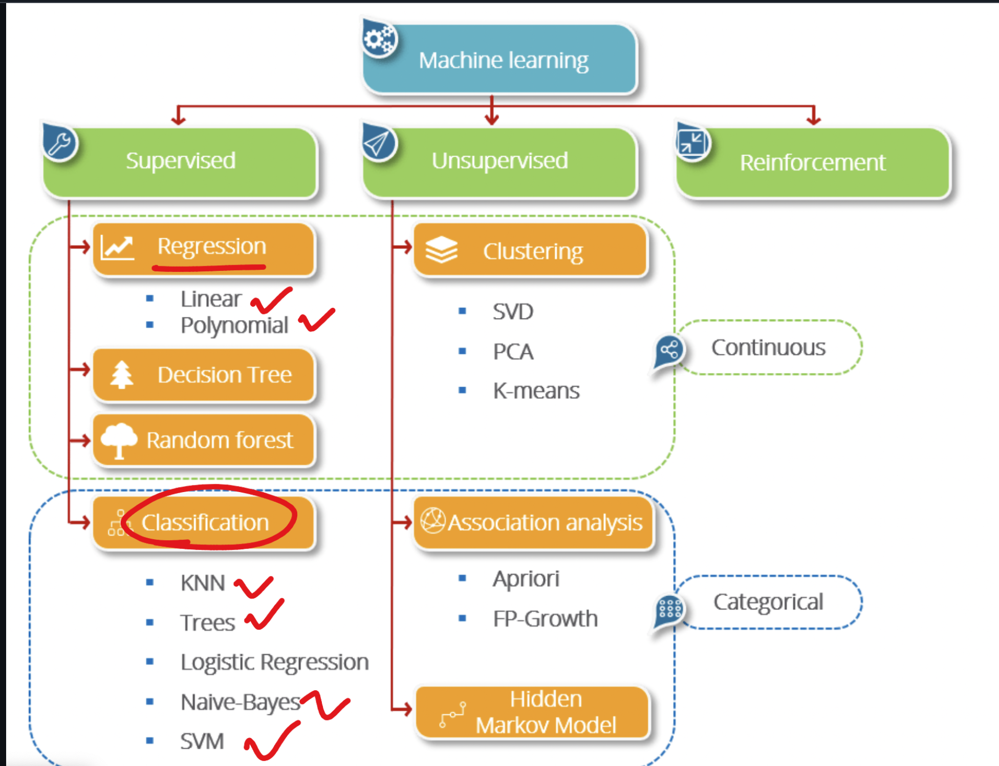
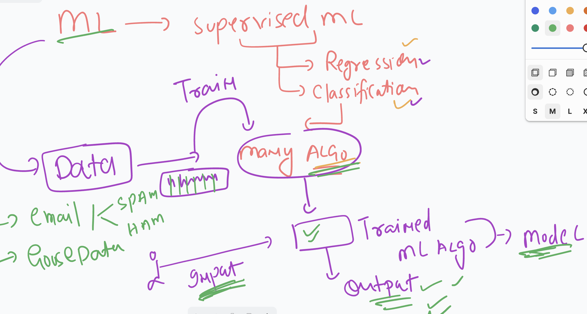
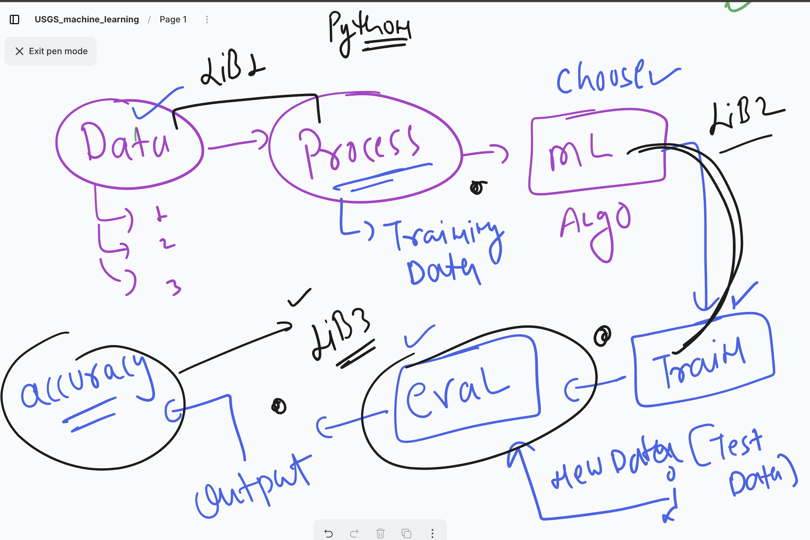
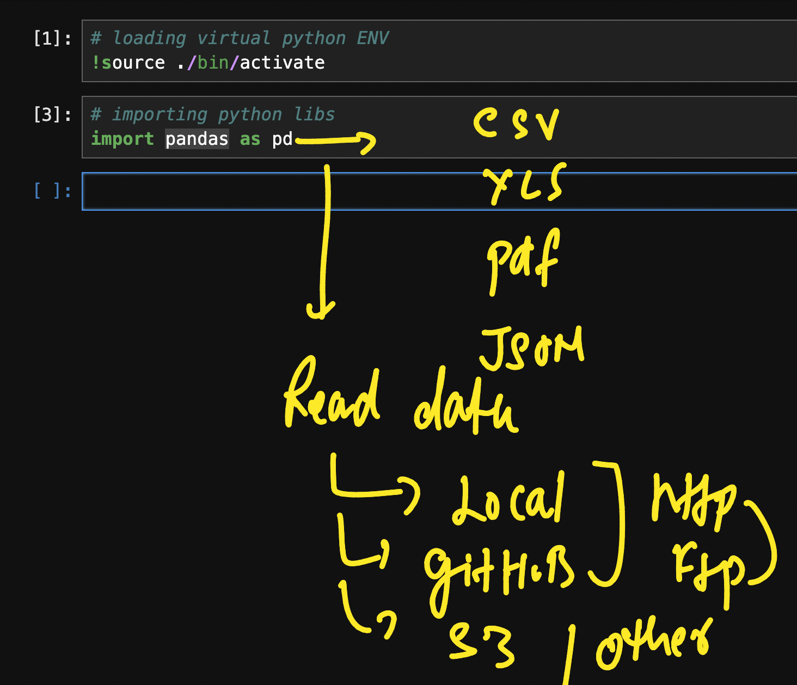

### data storage and usage 



### Understanding machine learning 



### Basic about Deep learning 



## getting started with Machine learning 



### More info about Machine learning category 



## after login to Ubuntu OS lets check some basic info for ML_DL purpose

### OS version 

```
cat  /etc/os-release 

PRETTY_NAME="Ubuntu 24.04.2 LTS"
NAME="Ubuntu"
VERSION_ID="24.04"
VERSION="24.04.2 LTS (Noble Numbat)"
VERSION_CODENAME=noble
ID=ubuntu
ID_LIKE=debian
HOME_URL="https://www.ubuntu.com/"
SUPPORT_URL="https://help.ubuntu.com/"
BUG_REPORT_URL="https://bugs.launchpad.net/ubuntu/"
PRIVACY_POLICY_URL="https://www.ubuntu.com/legal/terms-and-policies/privacy-policy"
UBUNTU_CODENAME=noble
LOGO=ubuntu-logo
ubuntu@ip-172-31-85-84:~$ 

```

### Python Version --- for current ML libraies its good to Have 3.10 version

```
buntu@ip-172-31-85-84:~$ python3 -V
Python 3.12.3
ubuntu@ip-172-31-85-84:~$ 

```


### Creating python virtual environment 

```
buntu@ip-172-31-85-84:~$ python3 -m venv ashu-workspace
ubuntu@ip-172-31-85-84:~$ ls
Untitled.ipynb  barker-workspace   jupyterhub_config.py       jupyterhub_cookie_secret  usgs-ml
ashu-workspace  jupyterhub.sqlite  jupyterhub_config.py.back  nohup.out
ubuntu@ip-172-31-85-84:~$ 

```

### switching/activate  to created ENV 

```
ubuntu@ip-172-31-85-84:~$ source ashu-workspace/bin/activate

(ashu-workspace) ubuntu@ip-172-31-85-84:~$ 

```

## as we know the purpose of ML is to train algo 



### Understanding any ML model training process 



### installing pandas in your personal python VENV 

```
buntu@ip-172-31-85-84:~$ source ashu-workspace/bin/activate
(ashu-workspace) ubuntu@ip-172-31-85-84:~$ 
(ashu-workspace) ubuntu@ip-172-31-85-84:~$ pip install pandas 
Collecting pandas
  Using cached pandas-2.3.0-cp312-cp312-manylinux_2_17_x86_64.manylinux2014_x86_64.whl.metadata (91 kB)
Collecting numpy>=1.26.0 (from pandas)
  Using cached numpy-2.3.0-cp312-cp312-manylinux_2_28_x86_64.whl.metadata (62 kB)
Collecting python-dateutil>=2.8.2 (from pandas)
  Using cached python_dateutil-2.9.0.post0-py2.py3-none-any.whl.metadata (8.4 kB)
Collecting pytz>=2020.1 (from pandas)
  Using cached pytz-2025.2-py2.py3-none-any.whl.metadata 

```

## Pandas data read options



### dealing with many ML problem python has Scikit-learn 

```
 pip install scikit-learn 
```

