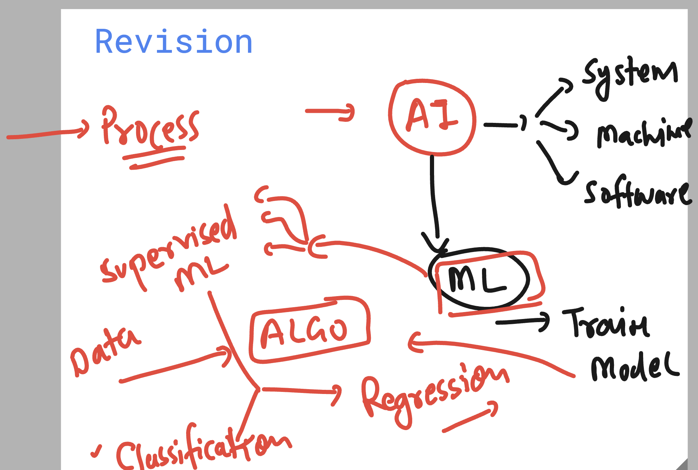
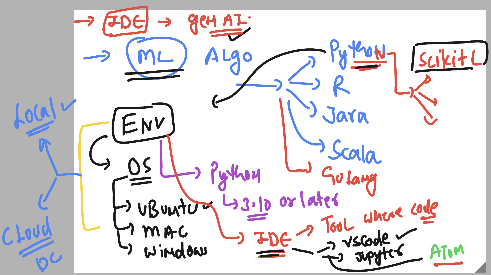
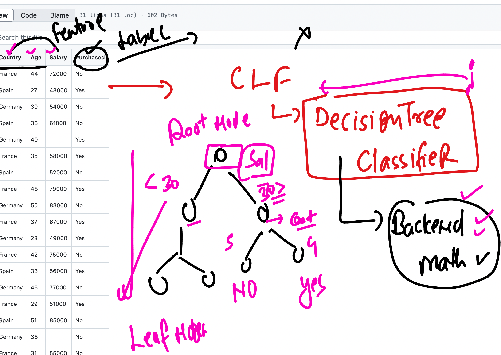
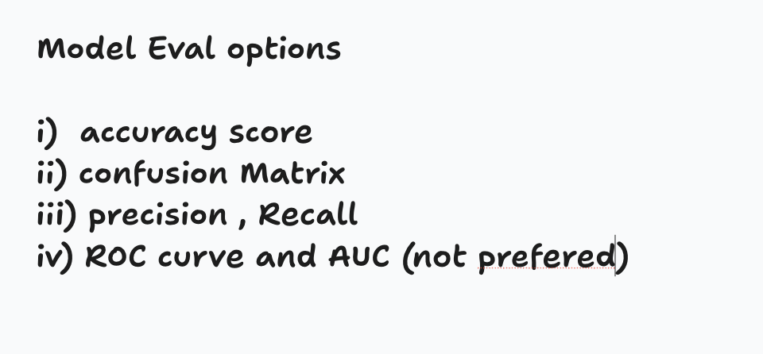
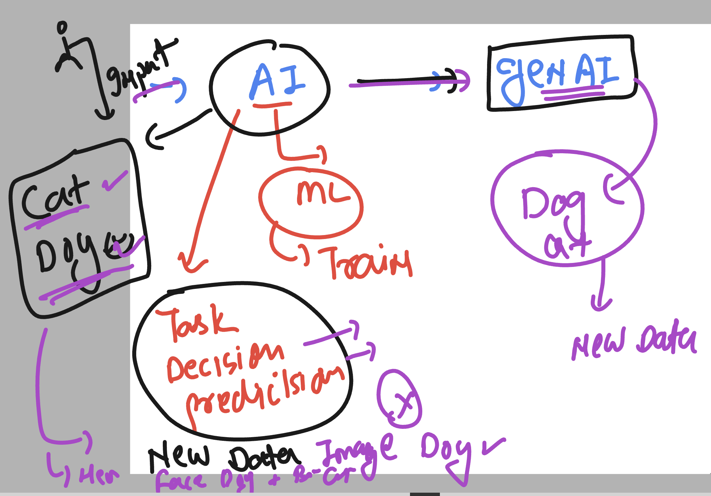
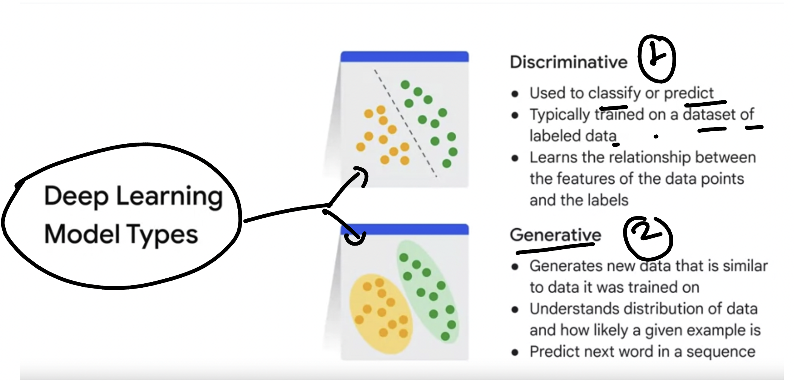
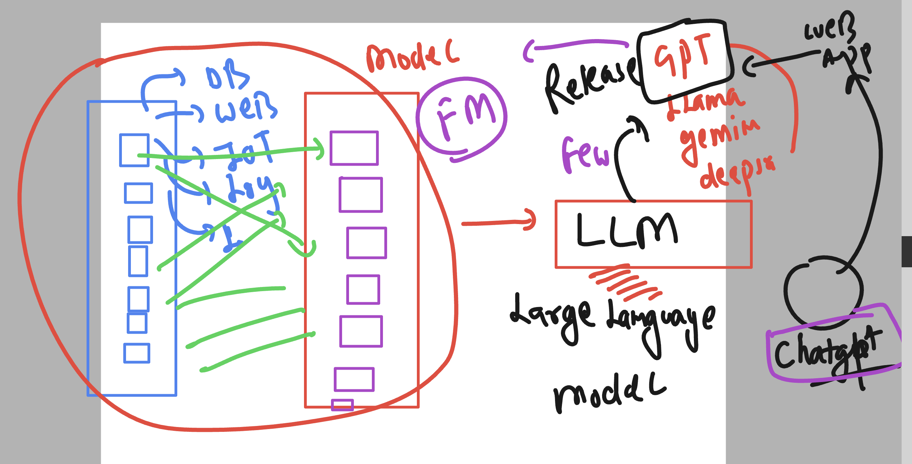
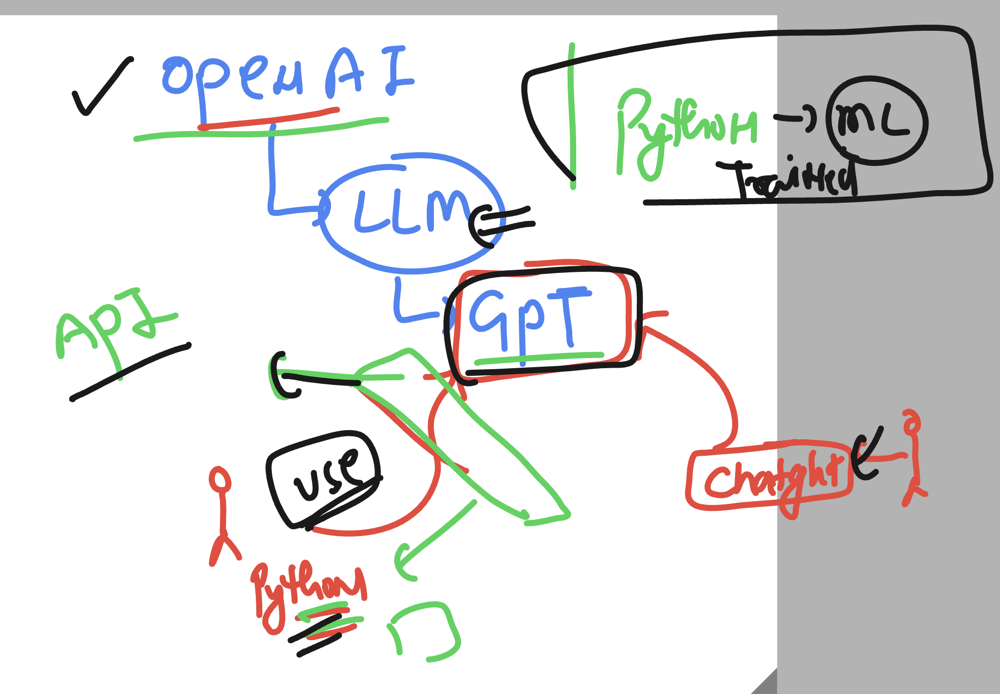

## Revision 



## code Env discussion 



## checking things in remove ubuntu machine 

### checking os details 
```
buntu@ip-172-31-85-84:~$ cat /etc/os-release 

PRETTY_NAME="Ubuntu 24.04.2 LTS"
NAME="Ubuntu"
VERSION_ID="24.04"
VERSION="24.04.2 LTS (Noble Numbat)"
VERSION_CODENAME=noble
ID=ubuntu
ID_LIKE=debian
HOME_URL="https://www.ubuntu.com/"
SUPPORT_URL="https://help.ubuntu.com/"
BUG_REPORT_URL="https://bugs.launchpad.net/ubuntu/"
PRIVACY_POLICY_URL="https://www.ubuntu.com/legal/terms-and-policies/privacy-policy"
UBUNTU_CODENAME=noble
LOGO=ubuntu-logo
```
### checking python VENV names 

```

ubuntu@ip-172-31-85-84:~$ ls
Untitled.ipynb   barker-workspace  jdelaney-workspace    jupyterhub_config.py.back  nohup.out          rocelia-workspace
Untitled1.ipynb  ck-workspace      jenc-workspace        jupyterhub_cookie_secret   olivia-workspace   saloum-workspace
anders-working   cmj_workspace     jupyterhub-proxy.pid  lauren-workspace           rcm-workspace      smith-workspace
ashu-workspace   dblair-workspace  jupyterhub.sqlite     marlo-workspace            rebecca-workspace  usgs-ml
ashu.ipynb       dwief             jupyterhub_config.py  mk-workspace               riley-workspace    xandra-workspace

```
### loading python VENV and checking libs 

```
ubuntu@ip-172-31-85-84:~$ 
ubuntu@ip-172-31-85-84:~$ source ashu-workspace/bin/activate
(ashu-workspace) ubuntu@ip-172-31-85-84:~$ pip  install numpy pandas scikit-learn 
Requirement already satisfied: numpy in ./ashu-workspace/lib/python3.12/site-packages (2.3.0)
Requirement already satisfied: pandas in ./ashu-workspace/lib/python3.12/site-packages (2.3.0)
Requirement already satisfied: scikit-learn in ./ashu-workspace/lib/python3.12/site-packages (1.7.0)
Requirement already satisfied: python-dateutil>=2.8.2 in ./ashu-workspace/lib/python3.12/site-packages (from pandas) (2.9.0.post0)
Requirement already satisfied: pytz>=2020.1 in ./ashu-workspace/lib/python3.12/site-packages (from pandas) (2025.2)
Requirement already satisfied: tzdata>=2022.7 in ./ashu-workspace/lib/python3.12/site-packages (from pandas) (2025.2)
Requirement already satisfied: scipy>=1.8.0 in ./ashu-workspace/lib/python3.12/site-packages (from scikit-learn) (1.15.3)
Requirement already satisfied: joblib>=1.2.0 in ./ashu-workspace/lib/python3.12/site-packages (from scikit-learn) (1.5.1)
Requirement already satisfied: threadpoolctl>=3.1.0 in ./ashu-workspace/lib/python3.12/site-packages (from scikit-learn) (3.6.0)
Requirement already satisfied: six>=1.5 in ./ashu-workspace/lib/python3.12/site-packages (from python-dateutil>=2.8.2->pandas) (1.17.0)

```

### Decision Tree Classifier understanding -- concepts



### checking some classification algo in python CLI 

```
ashu-workspace) ubuntu@ip-172-31-85-84:~$ python
Python 3.12.3 (main, Feb  4 2025, 14:48:35) [GCC 13.3.0] on linux
Type "help", "copyright", "credits" or "license" for more information.
>>> 
>>> from sklearn.tree import DecisionTreeClassifier 
>>> help(DecisionTreeClassifier)

>>> help(DecisionTreeClassifier)

>>> from sklearn.svm import  SVC 
>>> help(SVC) 
KeyboardInterrupt
>>> 

```

### to DO model eval we have some options given below 



### to see decisionTree plot we gonna use matplotlib 

```
pip install matplotlib 
```

### AI to GENAI 



### AI models category 




## info about LLM & Foundational Model in GENAI



### Some basic Idea about Interacting with LLM --(GPT)



## To interact with GPT LLM -- using openai 

### installing python openai library 

```
pip install openai
pip install seaborn 
```


