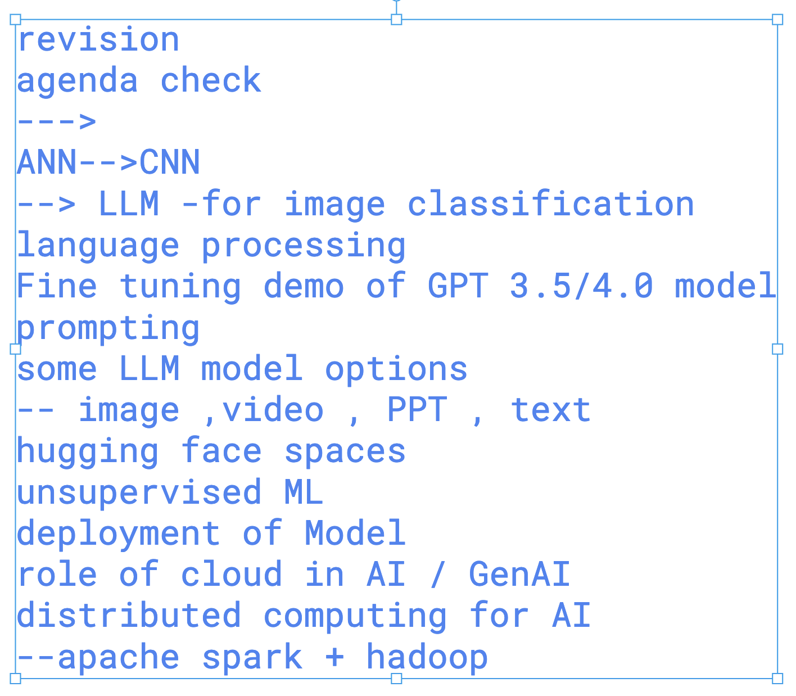
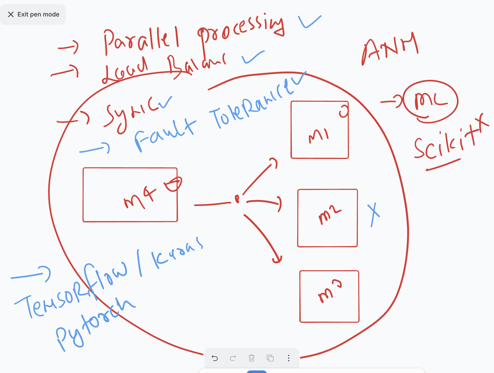
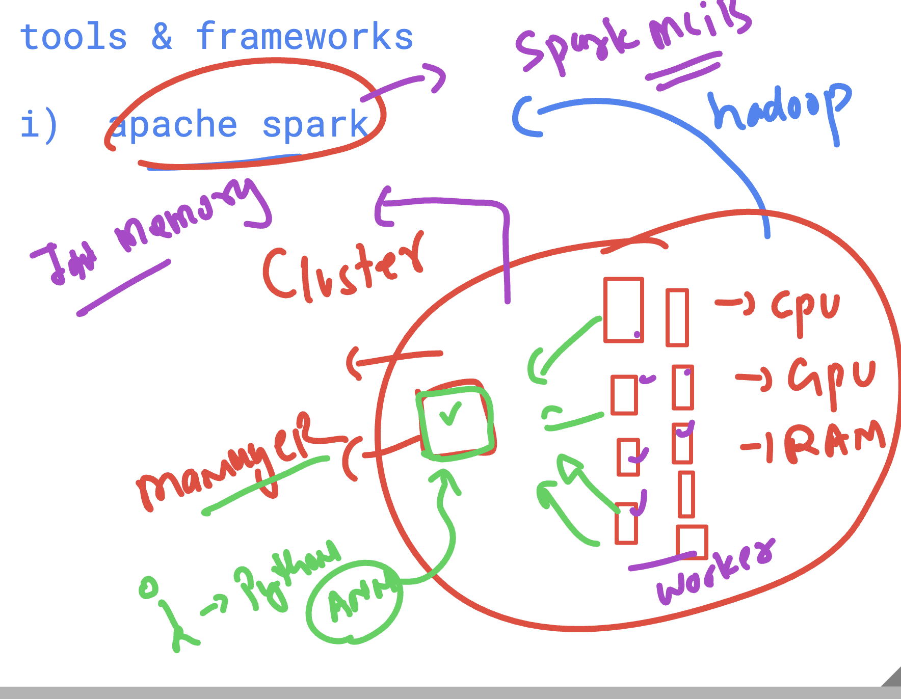
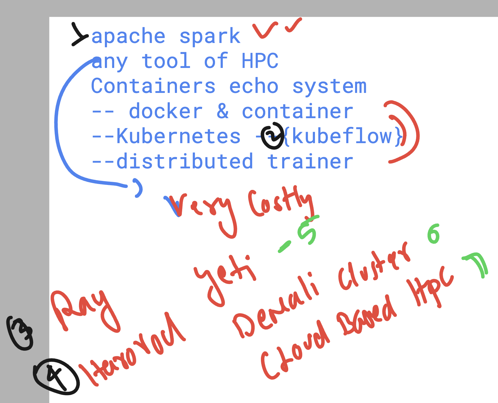
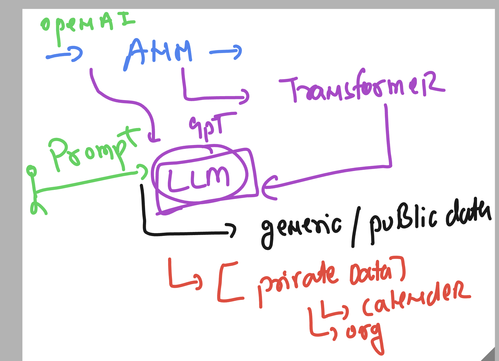
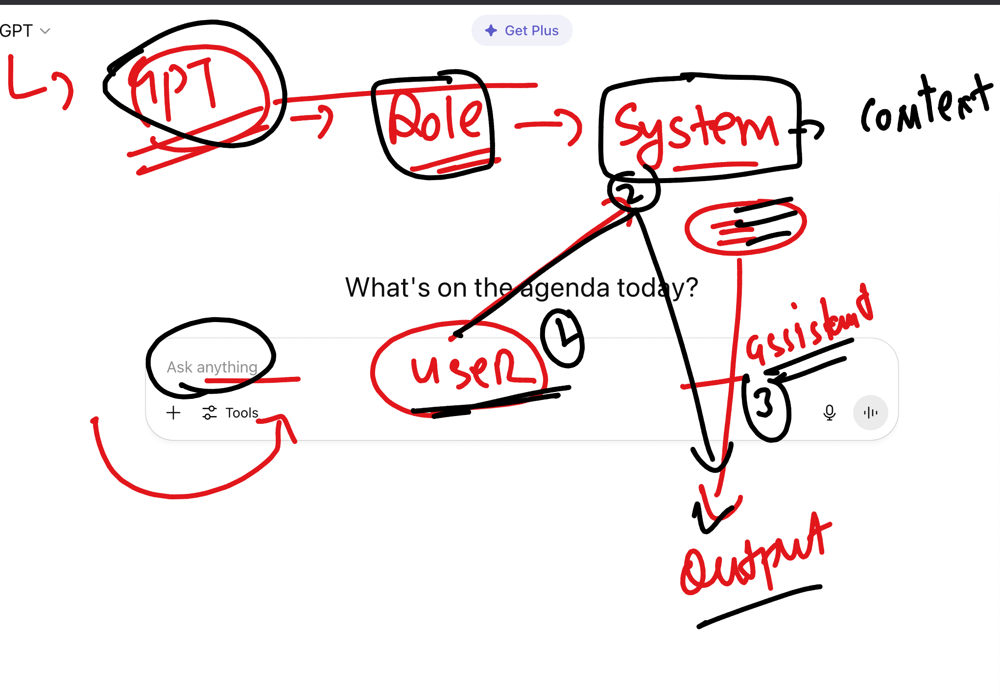
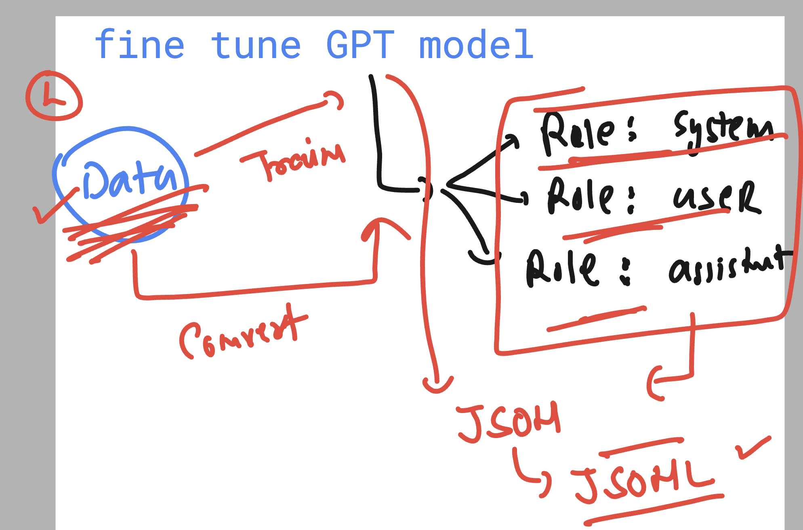

# Overall things to be covered 

### Training any kind of NN in distributed computing infra 

### apache spark  for distributed processing and Model training 

### More info about training ANN or similar model in real world 

### LLM fine tuning understanding 

### GPT model internal workflow understanding while doing query 

## fine tuning process of GPT model 

### 1:  COnvert data into Jsonl format 

